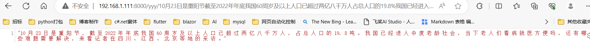
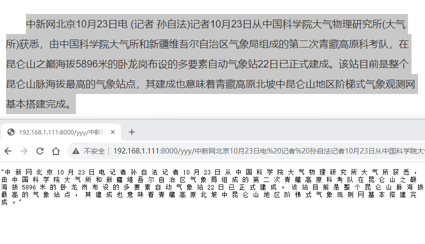
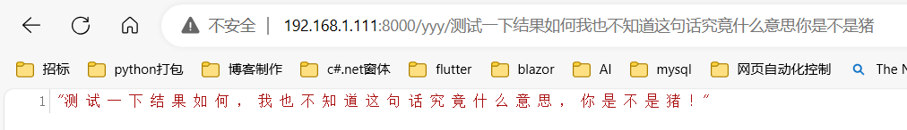
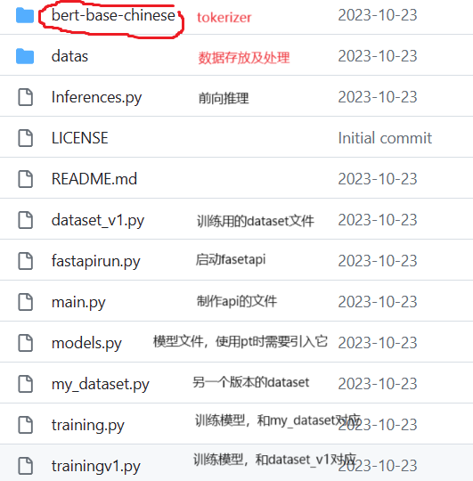
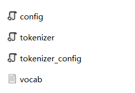
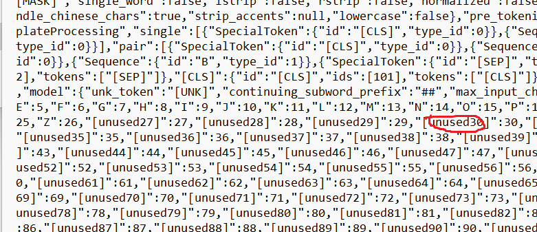
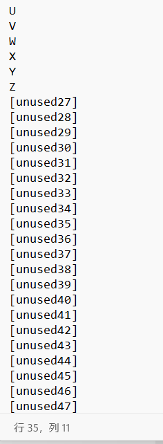
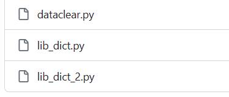

# easy_punctuation | 针对中文流式语音识别的自监督训练的标点添加/混淆修正模型

A punctuation addition library based on the Transformer model

由于主要针对中文，英文说明就不写了 ：）

本项目基于transformer和bert-chinese，训练数据集只需要正常有标点的文本，不用对应lable之类，此外并无额外限制。

目前仍处于项目前中期，请直接下载文件使用，接下来会讲解每个文件的作用。我们并不希望您再安装额外的库。

## 使用方法

### python直接使用

下载本项目、下载模型文件（已上传），将inference文件和对应模型文件拖入您的项目，调用推理方法即可,模型下载地址：

[([lzy510016411/easy_punc at main (huggingface.co)](https://huggingface.co/lzy510016411/easy_punc/tree/main))

### 使用fastapi

服务端：扒下来文档放入项目中，直接运行fastapirun.py

客户端：

```python
import asyncio
import aiohttp

async def add_punc(text):
    url = f"http://127.0.0.1:8000/punc/{text}"
    async with aiohttp.ClientSession() as session:
        response = await session.get(url)
        res = await response.text()
        return res
```

修改为自己定的IP和端口即可

## 效果（输入均为无标点）

**短句子**

输入：设计方面官方称工程师为这款笔记本设计了一款全新的锻造碳纤维A面可在让机身重量更轻的同时为每台笔记本赋予独一无二的外观纹理

输出：设 计 方 面 ， 官 方 称 工 程 师 为 这 款 笔 记 本 ， 设 计 了 一 款 全 新 的 锻 造 碳 纤 维 A 面 ， 可 在 让 机 身 重 量 更 轻 的 同 时 为 每 台 笔 记 本 赋 予 独 一 无 二 的 外 观 纹 理 。

**长句子**

输入：Docker是一种开源的容器技术可以通过容器来运行程序从而节省空间和资源提高效率和可以执行Docker容器是一种轻量级的虚拟化方式可以在服务器上运行应用程序而无需为每个应用程序安装完整的操作系统

输出：Docker 是 一 种 开 源 的 容 器 。 技 术 可 以 通 过 容 器 来 运 行 程 序 ， 从 而 节 省 空 间 和 资 源 ， 提 高 效 率 和 可 以 执 行 。 Docker 容 器 是 一 种 轻 量 级 的 虚 拟 化 方 式 ， 可 以 在 服 务 器 上 运 行 应 用 程 序 ， 而 无 需 为 每 个 应 用 程 序 安 装 完 整 的 操 作 系 统 

**中英文夹杂**



**带数字效果也很好**



**感叹号也可以识别出来**



### 

### 模型结构


## 项目构成（非常详细）



### bert-base-chinese



本项目仅使用bertbasechinese的tokenizer，目前为区分大小写字母，将26个大写英文放入，具体位置见vocab和tokenizer，其中模型需要自己去huggingface下载，放入本文件夹即可。

若需另外添加特殊字符

        方法1：使用python代码添加，此处不赘述，一搜就有；

        当添加词汇数量较少时，请用方法2：先打开**tokenizer**文件，



修改unusedxx 部分，例如将”[unused87]“改为”questions“，然后打开**vocab**文件：



在对应行下修改，注意不需要减一等计算操作，unused后面跟的多少数字就是多少行。

### ### datas



数据集文件，其中lib_dict是指向txt文件具体位置的py文件，用于指定需要将哪些txt文件作为样本。

您可以将自己的数据集或我们为您准备的数据集放入该文件夹内，使用dataclear.py处理

### inference.py
